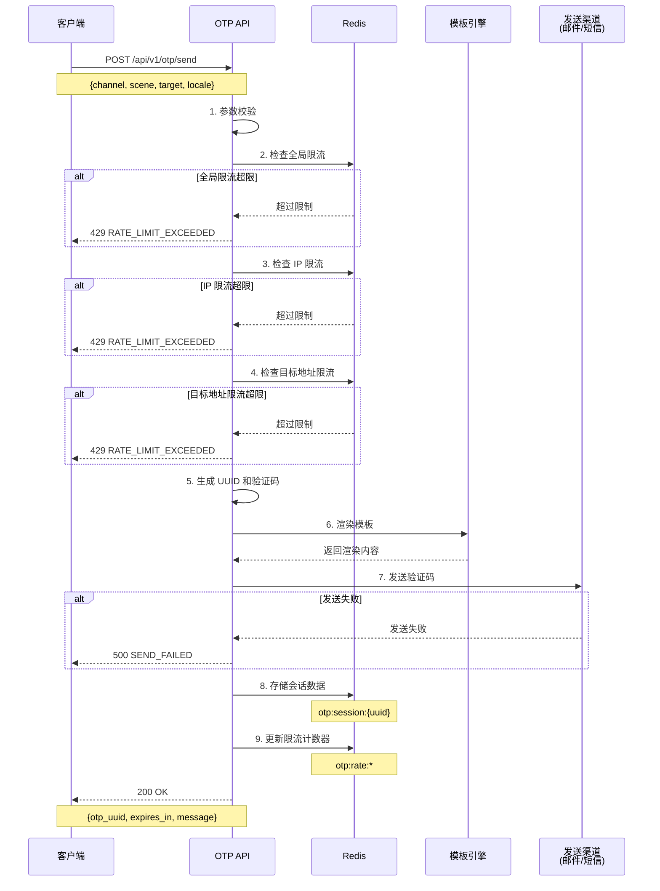
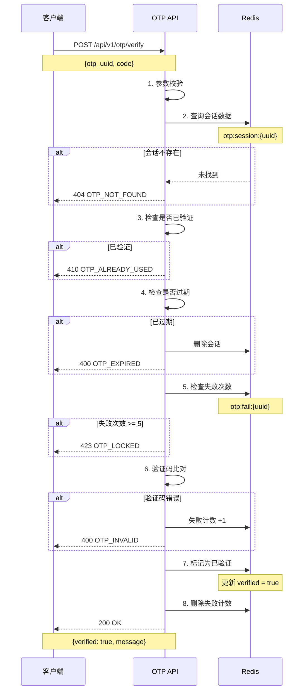

# OTP 验证码系统设计文档

## 1. 系统概述

### 1.1 设计目标

设计一套生产级、通用型邮箱/短信验证码（OTP）API系统，支持：

- **多业务场景**：登录、注册、绑定、重置密码等
- **多渠道支持**：邮件（EMAIL）、短信（SMS）
- **动态模板渲染**：基于场景自动匹配模板，支持占位符替换
- **UUID 会话追踪**：通过全局唯一 UUID 实现参数解耦与防重放
- **企业级安全**：限流、防刷、过期控制、失败锁定

### 1.2 核心特性

- ✅ 场景化动态内容渲染（Hutool 模板引擎）
- ✅ UUID 驱动验证机制（无需传递敏感信息）
- ✅ Redis 分布式会话管理
- ✅ 多维度限流策略（IP、目标地址、全局）
- ✅ 标准化错误码体系
- ✅ 多语言支持（i18n）

---

## 2. API 契约设计

### 2.1 发送验证码接口

**接口定义**

```http
POST /api/v1/otp/send
Content-Type: application/json
```

**请求参数（Request）**

```json
{
  "channel": "EMAIL",
  "scene": "REGISTER",
  "target": "user@example.com",
  "locale": "zh_CN"
}
```


**字段说明**

| 字段 | 类型 | 必填 | 说明 |
|------|------|------|------|
| channel | String | 是 | 发送渠道：`EMAIL`（邮件）、`SMS`（短信） |
| scene | String | 是 | 业务场景：`LOGIN`、`REGISTER`、`BIND_EMAIL`、`BIND_PHONE`、`RESET_PASSWORD`、`CHANGE_EMAIL`、`CHANGE_PHONE`、`DELETE_ACCOUNT` |
| target | String | 是 | 目标地址（邮箱或手机号） |
| locale | String | 否 | 语言代码，默认 `zh_CN`，支持 `en_US` 等 |

**成功响应（Response）**

```json
{
  "otp_uuid": "550e8400-e29b-41d4-a716-446655440000",
  "expires_in": 300,
  "message": "验证码已发送"
}
```

**字段说明**

| 字段 | 类型 | 说明 |
|------|------|------|
| otp_uuid | String | 全局唯一会话标识（UUID v4） |
| expires_in | Integer | 验证码有效期（秒），默认 300 秒 |
| message | String | 提示信息 |

---

### 2.2 验证验证码接口

**接口定义**

```http
POST /api/v1/otp/verify
Content-Type: application/json
```

**请求参数（Request）**

```json
{
  "otp_uuid": "550e8400-e29b-41d4-a716-446655440000",
  "code": "123456"
}
```


**字段说明**

| 字段 | 类型 | 必填 | 说明 |
|------|------|------|------|
| otp_uuid | String | 是 | 发送接口返回的会话 UUID |
| code | String | 是 | 用户输入的验证码（6位数字） |

**成功响应（Response）**

```json
{
  "verified": true,
  "message": "验证成功"
}
```

**字段说明**

| 字段 | 类型 | 说明 |
|------|------|------|
| verified | Boolean | 验证结果：`true` 成功，`false` 失败 |
| message | String | 提示信息 |

---

### 2.3 标准错误码规范

| HTTP 状态码 | 错误码 | 说明 | 场景 |
|------------|--------|------|------|
| 400 | OTP_INVALID | 验证码错误 | 用户输入的验证码不匹配 |
| 400 | OTP_EXPIRED | 验证码已过期 | 超过有效期（默认 5 分钟） |
| 404 | OTP_NOT_FOUND | 会话不存在 | UUID 无效或已被清理 |
| 410 | OTP_ALREADY_USED | 验证码已使用 | 同一验证码不可重复验证 |
| 429 | RATE_LIMIT_EXCEEDED | 请求过于频繁 | 触发限流策略 |
| 423 | OTP_LOCKED | 验证失败次数过多 | 连续失败 5 次后锁定 |
| 400 | INVALID_TARGET | 目标地址格式错误 | 邮箱或手机号格式不合法 |
| 500 | SEND_FAILED | 发送失败 | 邮件/短信服务异常 |

**错误响应示例**

```json
{
  "code": "RATE_LIMIT_EXCEEDED",
  "message": "请求过于频繁，请 60 秒后重试",
  "retry_after": 60
}
```


---

## 3. UUID 驱动验证机制

### 3.1 设计原理

**传统方式的问题**

```json
// ❌ 传统验证需要传递敏感信息
{
  "target": "user@example.com",
  "code": "123456",
  "scene": "REGISTER"
}
```

**UUID 驱动方式的优势**

```json
// ✅ 仅需 UUID + 验证码
{
  "otp_uuid": "550e8400-e29b-41d4-a716-446655440000",
  "code": "123456"
}
```

**核心优势**

1. **参数解耦**：验证接口无需传递目标地址、场景等敏感信息
2. **防重放攻击**：UUID 一次性使用，验证后立即失效
3. **并发隔离**：同一用户多场景验证互不干扰
4. **审计追踪**：通过 UUID 可追溯完整验证链路

### 3.2 会话上下文存储

服务端通过 UUID 反向解析出完整上下文：

```json
{
  "uuid": "550e8400-e29b-41d4-a716-446655440000",
  "channel": "EMAIL",
  "scene": "REGISTER",
  "target": "user@example.com",
  "code": "123456",
  "created_at": 1704067200,
  "expires_at": 1704067500,
  "verified": false,
  "fail_count": 0
}
```


---

## 4. Redis 数据结构设计

### 4.1 会话数据（Session）

**Key 模式**

```
otp:session:{uuid}
```

**Value 格式（JSON）**

```json
{
  "uuid": "550e8400-e29b-41d4-a716-446655440000",
  "channel": "EMAIL",
  "scene": "REGISTER",
  "target": "user@example.com",
  "code": "123456",
  "created_at": 1704067200,
  "expires_at": 1704067500,
  "verified": false,
  "fail_count": 0,
  "locale": "zh_CN"
}
```

**TTL**：300 秒（5 分钟）

**用途**：存储验证码会话的完整上下文，验证时通过 UUID 反向查询

**淘汰策略**：过期自动删除（Redis TTL）

---

### 4.2 目标地址限流（Rate Limit - Target）

**Key 模式**

```
otp:rate:target:{channel}:{target}
```

**示例**

```
otp:rate:target:EMAIL:user@example.com
otp:rate:target:SMS:13800138000
```

**Value 格式**：计数器（Integer）

```
3
```

**TTL**：60 秒

**用途**：限制同一目标地址的发送频率（60 秒内最多 3 次）

**限流规则**

- 同一邮箱/手机号 60 秒内最多发送 3 次
- 超过限制返回 `429 RATE_LIMIT_EXCEEDED`


---

### 4.3 IP 限流（Rate Limit - IP）

**Key 模式**

```
otp:rate:ip:{ip_address}
```

**示例**

```
otp:rate:ip:192.168.1.100
```

**Value 格式**：计数器（Integer）

```
10
```

**TTL**：3600 秒（1 小时）

**用途**：限制同一 IP 的发送频率（1 小时内最多 10 次）

**限流规则**

- 同一 IP 地址 1 小时内最多发送 10 次
- 防止恶意批量发送

---

### 4.4 验证失败计数（Fail Counter）

**Key 模式**

```
otp:fail:{uuid}
```

**Value 格式**：计数器（Integer）

```
3
```

**TTL**：300 秒（与会话同步）

**用途**：记录验证失败次数，连续失败 5 次后锁定

**锁定规则**

- 同一 UUID 连续验证失败 5 次后锁定
- 锁定后返回 `423 OTP_LOCKED`
- 锁定时间与会话过期时间一致


---

### 4.5 全局限流（Rate Limit - Global）

**Key 模式**

```
otp:rate:global
```

**Value 格式**：计数器（Integer）

```
1000
```

**TTL**：60 秒

**用途**：限制系统全局发送频率（60 秒内最多 1000 次）

**限流规则**

- 防止系统资源耗尽
- 可根据实际业务量调整

---

### 4.6 数据生命周期总结

| Key 类型 | TTL | 淘汰策略 | 集群兼容性 |
|---------|-----|---------|-----------|
| `otp:session:{uuid}` | 300s | 过期自动删除 | ✅ 支持（无状态） |
| `otp:rate:target:{channel}:{target}` | 60s | 过期自动删除 | ✅ 支持（计数器） |
| `otp:rate:ip:{ip}` | 3600s | 过期自动删除 | ✅ 支持（计数器） |
| `otp:fail:{uuid}` | 300s | 过期自动删除 | ✅ 支持（计数器） |
| `otp:rate:global` | 60s | 过期自动删除 | ✅ 支持（计数器） |

**集群兼容性说明**

- 所有 Key 均为独立存储，无跨节点依赖
- 计数器操作使用 Redis 原子命令（INCR）
- 支持 Redis Cluster 和主从复制


---

## 5. 模板引擎设计

### 5.1 模板配置结构

**配置文件路径**

```
src/main/resources/templates/otp/
├── email/
│   ├── login_zh_CN.txt
│   ├── login_en_US.txt
│   ├── register_zh_CN.txt
│   ├── register_en_US.txt
│   ├── bind_email_zh_CN.txt
│   ├── reset_password_zh_CN.txt
│   └── ...
└── sms/
    ├── login_zh_CN.txt
    ├── login_en_US.txt
    ├── register_zh_CN.txt
    └── ...
```

### 5.2 模板示例

**邮件模板（email/register_zh_CN.txt）**

```
【WYH Admin】注册验证码

尊敬的用户：

您正在注册 WYH Admin 账号，验证码为：

{code}

验证码有效期为 {expires_in} 分钟，请勿泄露给他人。

如非本人操作，请忽略此邮件。

---
WYH Admin 团队
{timestamp}
```

**短信模板（sms/register_zh_CN.txt）**

```
【WYH Admin】您的注册验证码为：{code}，{expires_in}分钟内有效，请勿泄露。
```

### 5.3 模板占位符

| 占位符 | 说明 | 示例 |
|--------|------|------|
| `{code}` | 验证码 | `123456` |
| `{expires_in}` | 有效期（分钟） | `5` |
| `{target}` | 目标地址（脱敏） | `u***@example.com` |
| `{timestamp}` | 发送时间 | `2024-01-01 12:00:00` |
| `{ip}` | 请求 IP（可选） | `192.168.1.100` |


### 5.4 模板渲染逻辑

**Hutool 模板引擎使用**

```java
// 1. 加载模板
String templatePath = String.format("templates/otp/%s/%s_%s.txt", 
    channel.toLowerCase(), 
    scene.toLowerCase(), 
    locale);
String template = ResourceUtil.readUtf8Str(templatePath);

// 2. 构建数据模型
Map<String, Object> model = new HashMap<>();
model.put("code", code);
model.put("expires_in", expiresIn / 60);
model.put("target", maskTarget(target));
model.put("timestamp", DateUtil.now());
model.put("ip", requestIp);

// 3. 渲染模板
Template tpl = TemplateUtil.createTemplate(template);
String content = tpl.render(model);
```

### 5.5 模板管理策略

**配置中心化**

- 模板存储在配置文件中，支持热更新
- 可扩展为数据库存储，支持后台管理

**多语言支持**

- 通过 `locale` 参数自动匹配语言模板
- 默认 `zh_CN`，支持 `en_US`、`ja_JP` 等

**降级策略**

- 若指定语言模板不存在，降级到 `zh_CN`
- 若场景模板不存在，使用通用模板


---

## 6. 核心流程设计

### 6.1 发送验证码流程




### 6.2 验证验证码流程




---

## 7. 组件交互架构

### 7.1 系统架构图

```
┌─────────────────────────────────────────────────────────────┐
│                         客户端层                              │
│  (Web / Mobile / API Client)                                │
└────────────────────┬────────────────────────────────────────┘
                     │
                     │ HTTPS
                     ▼
┌─────────────────────────────────────────────────────────────┐
│                      API Gateway                             │
│  (限流、鉴权、日志)                                            │
└────────────────────┬────────────────────────────────────────┘
                     │
                     ▼
┌─────────────────────────────────────────────────────────────┐
│                    OTP Controller                            │
│  - POST /api/v1/otp/send                                    │
│  - POST /api/v1/otp/verify                                  │
└────────────────────┬────────────────────────────────────────┘
                     │
                     ▼
┌─────────────────────────────────────────────────────────────┐
│                    OTP Service                               │
│  - 参数校验                                                   │
│  - 限流检查                                                   │
│  - 验证码生成                                                 │
│  - 模板渲染                                                   │
│  - 验证逻辑                                                   │
└──────┬──────────────────────┬──────────────────────┬────────┘
       │                      │                      │
       ▼                      ▼                      ▼
┌─────────────┐      ┌─────────────┐      ┌─────────────┐
│   Redis     │      │  Template   │      │   Channel   │
│   Cache     │      │   Engine    │      │   Service   │
│             │      │  (Hutool)   │      │             │
│ - Session   │      │             │      │ - Email     │
│ - Rate      │      │ - 模板加载   │      │ - SMS       │
│ - Fail      │      │ - 占位符替换 │      │             │
└─────────────┘      └─────────────┘      └──────┬──────┘
                                                  │
                                                  ▼
                                         ┌─────────────┐
                                         │  External   │
                                         │  Provider   │
                                         │             │
                                         │ - SMTP      │
                                         │ - SMS API   │
                                         └─────────────┘
```


### 7.2 数据流向

**发送流程数据流**

```
1. 客户端请求
   ↓
2. API Gateway (限流、鉴权)
   ↓
3. OTP Controller (接收参数)
   ↓
4. OTP Service (业务逻辑)
   ├─→ Redis (检查限流)
   ├─→ 生成 UUID 和验证码
   ├─→ Template Engine (渲染模板)
   ├─→ Channel Service (发送)
   │   └─→ External Provider (SMTP/SMS)
   └─→ Redis (存储会话)
   ↓
5. 返回 otp_uuid
```

**验证流程数据流**

```
1. 客户端请求 (otp_uuid + code)
   ↓
2. API Gateway
   ↓
3. OTP Controller
   ↓
4. OTP Service
   ├─→ Redis (查询会话)
   ├─→ 验证码比对
   ├─→ Redis (更新状态/失败计数)
   └─→ 返回验证结果
```


---

## 8. 安全策略

### 8.1 多维度限流

| 维度 | 限制规则 | 时间窗口 | 目的 |
|------|---------|---------|------|
| 全局 | 1000 次/分钟 | 60s | 防止系统资源耗尽 |
| IP | 10 次/小时 | 3600s | 防止单 IP 恶意攻击 |
| 目标地址 | 3 次/分钟 | 60s | 防止骚扰用户 |
| 验证失败 | 5 次锁定 | 300s | 防止暴力破解 |

### 8.2 验证码安全

**生成规则**

- 6 位纯数字
- 使用安全随机数生成器（SecureRandom）
- 避免连续数字（如 123456）
- 避免重复数字（如 111111）

**存储安全**

- 验证码不可逆加密存储（可选）
- 验证后立即失效
- 过期自动清理

### 8.3 防重放攻击

- UUID 一次性使用
- 验证成功后标记 `verified = true`
- 再次验证返回 `410 OTP_ALREADY_USED`

### 8.4 敏感信息保护

**目标地址脱敏**

```java
// 邮箱脱敏：u***@example.com
// 手机号脱敏：138****8000
```

**日志脱敏**

- 验证码不记录到日志
- 目标地址脱敏后记录


---

## 9. 配置管理

### 9.1 系统配置

**application.yml**

```yaml
otp:
  # 验证码配置
  code:
    length: 6                    # 验证码长度
    expires-in: 300              # 有效期（秒）
    
  # 限流配置
  rate-limit:
    global:
      max: 1000                  # 全局限流（次/分钟）
      window: 60                 # 时间窗口（秒）
    ip:
      max: 10                    # IP 限流（次/小时）
      window: 3600
    target:
      max: 3                     # 目标地址限流（次/分钟）
      window: 60
    fail:
      max: 5                     # 最大失败次数
      
  # 模板配置
  template:
    base-path: templates/otp     # 模板基础路径
    default-locale: zh_CN        # 默认语言
    
  # 渠道配置
  channel:
    email:
      enabled: true              # 是否启用邮件渠道
      from: noreply@example.com  # 发件人
      subject-prefix: "【WYH Admin】"
    sms:
      enabled: true              # 是否启用短信渠道
      provider: aliyun           # 短信服务商
      sign-name: "WYH Admin"     # 短信签名
```

### 9.2 场景枚举

**OtpScene.java**

```java
public enum OtpScene {
    LOGIN("登录验证"),
    REGISTER("注册验证"),
    BIND_EMAIL("绑定邮箱"),
    BIND_PHONE("绑定手机"),
    RESET_PASSWORD("重置密码"),
    CHANGE_EMAIL("修改邮箱"),
    CHANGE_PHONE("修改手机"),
    DELETE_ACCOUNT("注销账号");
    
    private final String description;
}
```


### 9.3 渠道枚举

**OtpChannel.java**

```java
public enum OtpChannel {
    EMAIL("邮件"),
    SMS("短信");
    
    private final String description;
}
```

---

## 10. 监控与运维

### 10.1 关键指标

**业务指标**

- 发送成功率（按渠道、场景统计）
- 验证成功率
- 平均验证时长
- 限流触发次数

**性能指标**

- API 响应时间（P50、P95、P99）
- Redis 操作耗时
- 发送渠道耗时

**安全指标**

- 验证失败率
- 锁定次数
- 异常 IP 统计

### 10.2 日志规范

**发送日志**

```json
{
  "action": "otp_send",
  "otp_uuid": "550e8400-e29b-41d4-a716-446655440000",
  "channel": "EMAIL",
  "scene": "REGISTER",
  "target": "u***@example.com",
  "ip": "192.168.1.100",
  "status": "success",
  "timestamp": "2024-01-01T12:00:00Z"
}
```

**验证日志**

```json
{
  "action": "otp_verify",
  "otp_uuid": "550e8400-e29b-41d4-a716-446655440000",
  "result": "success",
  "fail_count": 0,
  "timestamp": "2024-01-01T12:05:00Z"
}
```


### 10.3 告警规则

| 指标 | 阈值 | 级别 | 处理建议 |
|------|------|------|---------|
| 发送失败率 > 10% | 5 分钟内 | P1 | 检查邮件/短信服务 |
| API 响应时间 > 3s | P95 | P2 | 检查 Redis 性能 |
| 限流触发次数 > 100 | 1 分钟内 | P2 | 检查是否遭受攻击 |
| 验证失败率 > 50% | 5 分钟内 | P3 | 检查用户体验问题 |

---

## 11. 扩展性设计

### 11.1 新增渠道

**步骤**

1. 在 `OtpChannel` 枚举中添加新渠道
2. 实现 `ChannelService` 接口
3. 添加对应的模板文件
4. 配置渠道参数

**示例：添加企业微信渠道**

```java
public enum OtpChannel {
    EMAIL("邮件"),
    SMS("短信"),
    WECHAT_WORK("企业微信");  // 新增
}
```

### 11.2 新增场景

**步骤**

1. 在 `OtpScene` 枚举中添加新场景
2. 为每个渠道添加对应的模板文件
3. 无需修改业务逻辑代码

**示例：添加实名认证场景**

```java
public enum OtpScene {
    // ... 现有场景
    REAL_NAME_AUTH("实名认证");  // 新增
}
```

### 11.3 多语言扩展

**步骤**

1. 添加新语言的模板文件（如 `login_ja_JP.txt`）
2. 客户端传递 `locale` 参数
3. 系统自动匹配对应语言模板


---

## 12. 实现清单

### 12.1 后端模块

**核心类**

- `OtpController` - API 控制器
- `OtpService` - 业务逻辑服务
- `OtpSession` - 会话数据模型
- `OtpChannel` - 渠道枚举
- `OtpScene` - 场景枚举
- `OtpException` - 自定义异常

**发送渠道**

- `ChannelService` - 渠道服务接口
- `EmailChannelService` - 邮件渠道实现
- `SmsChannelService` - 短信渠道实现

**模板引擎**

- `TemplateService` - 模板服务
- `TemplateLoader` - 模板加载器

**限流组件**

- `RateLimiter` - 限流器接口
- `RedisRateLimiter` - Redis 限流实现

**工具类**

- `OtpCodeGenerator` - 验证码生成器
- `TargetMasker` - 目标地址脱敏工具

### 12.2 配置文件

- `application.yml` - 系统配置
- `templates/otp/**/*.txt` - 模板文件

### 12.3 数据库（可选）

如需持久化审计日志：

```sql
CREATE TABLE otp_log (
    id BIGSERIAL PRIMARY KEY,
    otp_uuid VARCHAR(36) NOT NULL,
    action VARCHAR(20) NOT NULL,  -- send / verify
    channel VARCHAR(20) NOT NULL,
    scene VARCHAR(50) NOT NULL,
    target VARCHAR(100) NOT NULL,
    ip VARCHAR(50),
    status VARCHAR(20) NOT NULL,  -- success / failed
    error_code VARCHAR(50),
    created_at TIMESTAMP NOT NULL DEFAULT CURRENT_TIMESTAMP,
    INDEX idx_uuid (otp_uuid),
    INDEX idx_target (target),
    INDEX idx_created_at (created_at)
);
```


---

## 13. 测试用例

### 13.1 发送接口测试

**正常场景**

- ✅ 发送邮件验证码成功
- ✅ 发送短信验证码成功
- ✅ 多语言模板渲染正确

**异常场景**

- ✅ 目标地址格式错误（400）
- ✅ 触发全局限流（429）
- ✅ 触发 IP 限流（429）
- ✅ 触发目标地址限流（429）
- ✅ 发送渠道异常（500）

### 13.2 验证接口测试

**正常场景**

- ✅ 验证码正确，验证成功
- ✅ 验证后会话标记为已使用

**异常场景**

- ✅ UUID 不存在（404）
- ✅ 验证码错误（400）
- ✅ 验证码已过期（400）
- ✅ 验证码已使用（410）
- ✅ 连续失败 5 次锁定（423）

### 13.3 并发测试

- ✅ 同一用户多场景并发发送
- ✅ 同一 UUID 并发验证
- ✅ 高并发限流准确性

### 13.4 性能测试

- ✅ 发送接口 QPS > 1000
- ✅ 验证接口 QPS > 5000
- ✅ P99 响应时间 < 500ms

---

## 14. 部署建议

### 14.1 Redis 配置

**推荐配置**

```yaml
# Redis 持久化
save ""                    # 禁用 RDB（OTP 数据无需持久化）
appendonly no              # 禁用 AOF

# 内存淘汰策略
maxmemory 2gb
maxmemory-policy volatile-ttl  # 优先淘汰 TTL 最短的 Key

# 连接池
maxclients 10000
```


### 14.2 应用配置

**JVM 参数**

```bash
-Xms2g -Xmx2g
-XX:+UseG1GC
-XX:MaxGCPauseMillis=200
```

**线程池配置**

```yaml
spring:
  task:
    execution:
      pool:
        core-size: 10
        max-size: 50
        queue-capacity: 1000
```

### 14.3 高可用部署

**架构**

```
┌─────────────┐
│   Nginx     │  (负载均衡)
└──────┬──────┘
       │
   ┌───┴───┐
   │       │
┌──▼──┐ ┌──▼──┐
│ App1│ │ App2│  (应用集群)
└──┬──┘ └──┬──┘
   │       │
   └───┬───┘
       │
┌──────▼──────┐
│ Redis       │  (主从 + 哨兵)
│ Cluster     │
└─────────────┘
```

**容灾策略**

- 应用层：至少 2 个实例
- Redis：主从复制 + 哨兵
- 发送渠道：多服务商备份

---

## 15. 常见问题（FAQ）

### Q1: 为什么使用 UUID 而不是直接传递目标地址？

**A:** UUID 驱动机制的优势：
- 参数解耦，验证接口无需传递敏感信息
- 防重放攻击，UUID 一次性使用
- 并发隔离，同一用户多场景互不干扰
- 审计追踪，完整记录验证链路

### Q2: 验证码为什么不加密存储？

**A:** 
- Redis 数据已通过网络加密（TLS）
- 验证码有效期短（5 分钟），风险可控
- 加密会增加性能开销
- 如有更高安全要求，可使用单向哈希（如 BCrypt）

### Q3: 如何防止短信轰炸？

**A:** 多维度限流策略：
- 目标地址限流：60 秒内最多 3 次
- IP 限流：1 小时内最多 10 次
- 全局限流：系统级保护
- 验证失败锁定：5 次失败后锁定

### Q4: 模板如何支持富文本邮件？

**A:** 
- 当前设计为纯文本模板
- 如需 HTML 邮件，可扩展模板引擎支持 HTML 模板
- 建议使用 Thymeleaf 或 FreeMarker

### Q5: 如何支持语音验证码？

**A:** 
- 在 `OtpChannel` 枚举中添加 `VOICE` 渠道
- 实现 `VoiceChannelService`
- 添加语音模板（TTS 文本）

---

## 16. 总结

本设计文档提供了一套完整的生产级 OTP 验证码系统方案，具备以下特点：

✅ **通用性强** - 支持多业务场景、多渠道、多语言  
✅ **安全可靠** - 多维度限流、防重放、防暴力破解  
✅ **易于扩展** - 模块化设计，新增渠道/场景无需改动核心逻辑  
✅ **性能优异** - Redis 缓存，支持高并发  
✅ **运维友好** - 完善的监控、日志、告警体系  

**下一步行动**

1. 根据本文档实现后端代码
2. 编写单元测试和集成测试
3. 配置监控和告警
4. 压力测试验证性能指标
5. 灰度发布上线

---

**文档版本**: v1.0  
**最后更新**: 2024-01-01  
**维护者**: WYH Admin 团队
